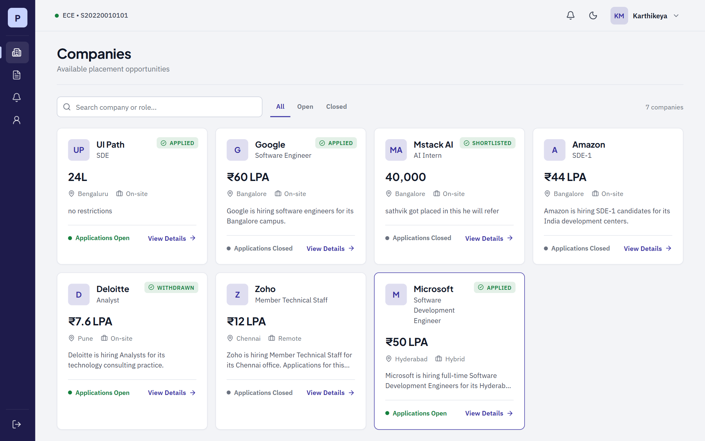
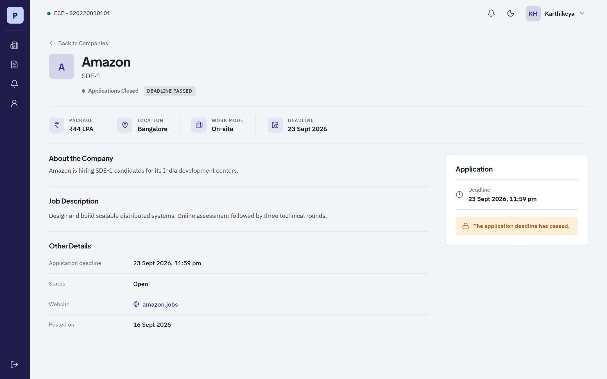
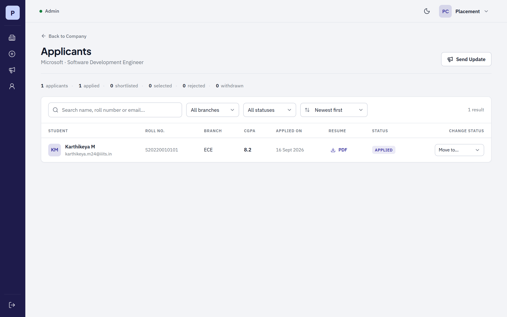
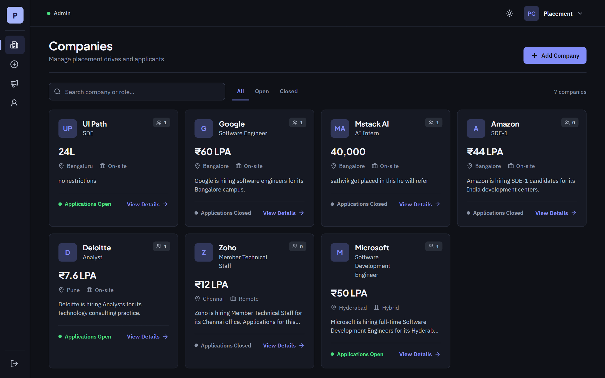

# PlacementHub

A placement management portal for a college placement cell. Students browse companies and apply
with a saved resume; the placement cell manages drives, reviews applicants and moves each
application through its hiring stages.

**[Live demo](https://placementhub-opal.vercel.app)** &nbsp;·&nbsp;
[API health check](https://placementhub-api-tst5.onrender.com/api/health)

> The API runs on a free Render instance, which sleeps after 15 minutes idle.
> The first request can take up to a minute to wake it.

### Try it

| Role | Email | Password | Sign in with |
| ---- | ----- | -------- | ------------ |
| Student | `karthikeya.m24@iiits.in` | `Password@123` | Student tab |
| Admin | `admin@iiits.in` | `Password@123` | Admin tab |
| Super Admin | `superadmin@iiits.in` | `Password@123` | Admin tab |

All of it is sample data. Super Admins sign in through the Admin tab; the backend decides what
you can do from the role stored against your account.

---

## Screenshots

| Companies | Company details |
| --- | --- |
|  |  |

| Applicant review (admin) | Dark mode |
| --- | --- |
|  |  |

---

## What it does

**Students** register with a college `@iiits.in` email, complete their profile with roll number,
branch and CGPA, and keep up to five labelled PDF resumes. They browse companies, apply by
choosing which resume to send, confirm with their password, track every application, and
withdraw while an application is still pending.

**Admins** create and edit companies, attach a job-description PDF, and review applicants with
search, branch and status filters and CGPA sorting. They download resumes and move an
application from Applied to Shortlisted to Selected, or reject it. Every change notifies the
student.

**Super Admins** do everything an Admin can, plus create and deactivate administrator accounts.

---

## Tech stack

| Layer | Choice |
| ----- | ------ |
| Frontend | React 19, React Router 7, Axios, plain CSS with light and dark themes |
| Backend | Node.js, Express 5, Mongoose 9 |
| Database | MongoDB Atlas |
| Auth | JWT access tokens, bcrypt password hashing |
| Uploads | Multer in memory, PDF bytes stored in MongoDB |
| Build | Vite 8 |
| Tests | Node's built-in test runner with `mongodb-memory-server` |
| Hosting | Vercel (frontend), Render (API) |

No Redux, no Socket.IO, no component library. Shared state is three small React contexts.

---

## Architecture

```
Browser ──► React (Vercel) ──► Axios adds "Authorization: Bearer <jwt>"
                                        │
                                        ▼
                    Express (Render):  route → auth → requireRole → controller
                                        │
                                        ▼
                             Mongoose ──► MongoDB Atlas
```

The backend follows **Routes → Middleware → Controllers → Models**. Authentication and
authorization are deliberately separate: `middleware/auth.js` answers "who is this?" and
`middleware/requireRole.js` answers "are they allowed?".

```
server/
├── server.js                 starts the app: loads .env, connects, listens
├── app.js                    builds the Express app and mounts the route files
├── models/                   User, Company, Application, Notification, StoredFile
├── middleware/               auth, requireRole, upload, errorHandler
├── controllers/              all the business rules live here
├── routes/                   URL → middleware chain → controller
├── utils/                    httpError helper, validators
└── tests/api.test.js         37 end-to-end API tests

client/src/
├── App.jsx                   routes, and which roles may see them
├── api/axios.js              one Axios instance, attaches the token
├── context/                  AuthContext, ThemeContext, ToastContext
├── components/               ProtectedRoute, layout/, ui/
├── pages/                    auth/, student/, admin/, superadmin/
└── styles/                   CSS variables drive both themes
```

---

## Decisions worth explaining

**A student cannot apply twice, and the database guarantees it.** The controller checks for an
existing application, but that check has a race window. The real guarantee is a compound unique
index on `{ student, company }`; MongoDB rejects the second write and the error handler turns
duplicate-key error 11000 into a clean `409`.

**The token is an ID card, not a source of truth.** The JWT carries only a user id and role, and
`auth.js` re-reads the user from the database on every request. A deactivated account stops
working immediately rather than when the token expires, and the client can never claim a role it
does not have.

**Applying copies the PDF.** An application stores its own copy of the resume, so deleting a
resume from a profile later cannot break an application that has already been submitted.

**PDFs live in MongoDB, not on disk.** Free hosting gives you an ephemeral filesystem that is
wiped on every restart, so an uploaded resume would disappear within days. Storing the bytes in a
`storedfiles` collection keeps uploads working across restarts and across multiple instances. At
real scale the right answer is object storage such as S3, with only the URL in the database.

**Query parameters are validated, not trusted.** Sort fields are checked against an allow-list,
and search input is regex-escaped before it reaches a query.

---

## Running locally

```bash
# 1. API — http://localhost:5000
cd server
npm install
cp .env.example .env        # then fill in MONGO_URI and JWT_SECRET
npm run seed                # sample data. WARNING: wipes the database first
npm run dev

# 2. Frontend — http://localhost:5173
cd client
npm install
npm run dev
```

No MongoDB installed? `npm run dev:memory` in `server/` starts a temporary in-memory database,
seeds it, and runs the API against it.

| Script (in `server/`) | What it does |
| --------------------- | ------------ |
| `npm run dev` | API with auto-reload |
| `npm test` | 37 API tests, no database setup needed |
| `npm run seed` | Reset and seed the configured database |
| `npm run seed:superadmin` | Create or reset only the super admin, deleting nothing |
| `npm run dev:memory` | API plus seed data on a throwaway in-memory database |

### Environment variables

`server/.env`:

| Variable | Purpose |
| -------- | ------- |
| `MONGO_URI` | MongoDB connection string |
| `JWT_SECRET` | Signs and verifies tokens |
| `JWT_EXPIRES_IN` | Token lifetime, e.g. `1d` |
| `PORT` | Defaults to 5000 |
| `CLIENT_URL` | Allowed CORS origins, comma-separated |
| `NODE_ENV` | `production` hides error detail from responses |

`client/.env` needs `VITE_API_URL` only in production. Locally, Vite proxies `/api` to port 5000.

---

## API

Every response is `{ success, message?, data? }`. Protected routes need a valid token.

| Method | Route | Purpose | Who |
| ------ | ----- | ------- | --- |
| POST | `/api/auth/register` | Create a student account | Public |
| POST | `/api/auth/login` | Sign in, returns a token | Public |
| GET | `/api/auth/me` | Current user | Any |
| GET, PUT | `/api/users/profile` | Read or update own profile | Any |
| POST | `/api/users/resumes` | Save a resume, max 5 | Student |
| DELETE | `/api/users/resumes/:id` | Remove a saved resume | Student |
| GET | `/api/users/resumes/:id/download` | Download own resume | Student |
| GET | `/api/companies` | List companies | Any |
| GET | `/api/companies/:id` | One company | Any |
| POST, PUT | `/api/companies`, `/api/companies/:id` | Create or edit | Admin |
| PATCH | `/api/companies/:id/close` | Stop new applications | Admin |
| POST, DELETE, GET | `/api/companies/:id/job-description` | Manage the JD PDF | Admin, any to read |
| GET | `/api/companies/:id/applications` | Applicants, with search, filter and sort | Admin |
| POST | `/api/companies/:id/notifications` | Message active applicants | Admin |
| POST | `/api/applications` | Apply to a company | Student |
| GET | `/api/applications/my` | Own applications | Student |
| PATCH | `/api/applications/:id/withdraw` | Withdraw while pending | Owner |
| PATCH | `/api/applications/:id/status` | Change status, notifies the student | Admin |
| GET | `/api/applications/:id/resume` | Download the attached resume | Owner or Admin |
| GET | `/api/notifications` | Own notifications and unread count | Any |
| PATCH | `/api/notifications/:id/read`, `/read-all` | Mark as read | Owner |
| GET, POST | `/api/admin/users` | List or create administrators | Super Admin |
| PATCH | `/api/admin/users/:id/deactivate` | Deactivate an administrator | Super Admin |

Status codes: `200` ok, `201` created, `400` invalid input or broken rule, `401` not
authenticated, `403` authenticated but not allowed, `404` not found, `409` duplicate.

---

## Business rules

1. Student emails must end in `@iiits.in`, enforced by the server.
2. Registration always creates a STUDENT; only a Super Admin can create administrators.
3. One application per student per company, enforced by a unique index.
4. Withdrawing is allowed only while the status is Applied, and you cannot re-apply afterwards.
5. The deadline and company status are checked on the server, so a stale page cannot bypass them.
6. Status moves Applied → Shortlisted → Selected, or → Rejected. Nothing moves once final.
7. Company updates reach only active applicants, never rejected or withdrawn ones.
8. Companies are closed, never deleted, so placement history survives.
9. Administrators are deactivated, never deleted. You cannot deactivate yourself or the last
   active Super Admin.
10. No eligibility engine: the admin sees the CGPA and decides. Students may apply to many
    companies, including after being selected elsewhere.

---

## Testing

```bash
cd server && npm test
```

37 end-to-end tests run the real Express app against a temporary in-memory MongoDB. They cover
registration rules, login with a forged token, role permissions, the deadline and duplicate
guards, file type and size limits, withdrawal rules, status transitions, applicant search and
sort validation, notification targeting and ownership checks.

---

## Deployment

| Part | Host | Notes |
| ---- | ---- | ----- |
| API | Render web service | Root directory `server`, health check `/api/health` |
| Frontend | Vercel | Root directory `client`, build `npm run build` |
| Database | MongoDB Atlas | Network access must allow the API to connect |

`render.yaml` describes the API service so Render can create it from a Blueprint. `VITE_API_URL`
is read at **build time**, so changing it needs a redeploy rather than a restart.
